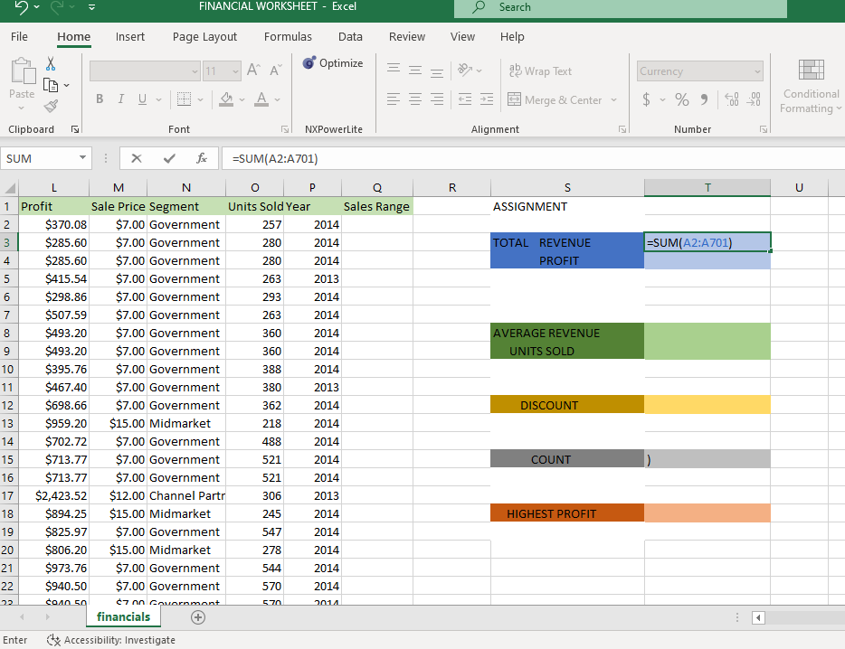
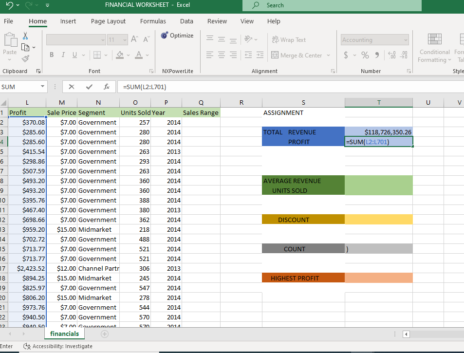
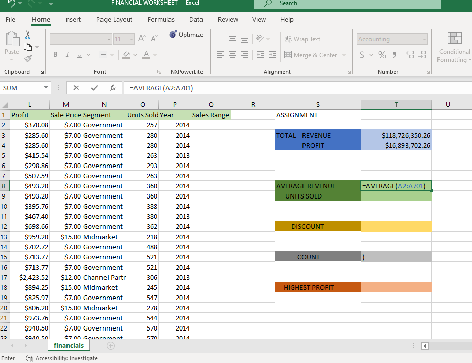
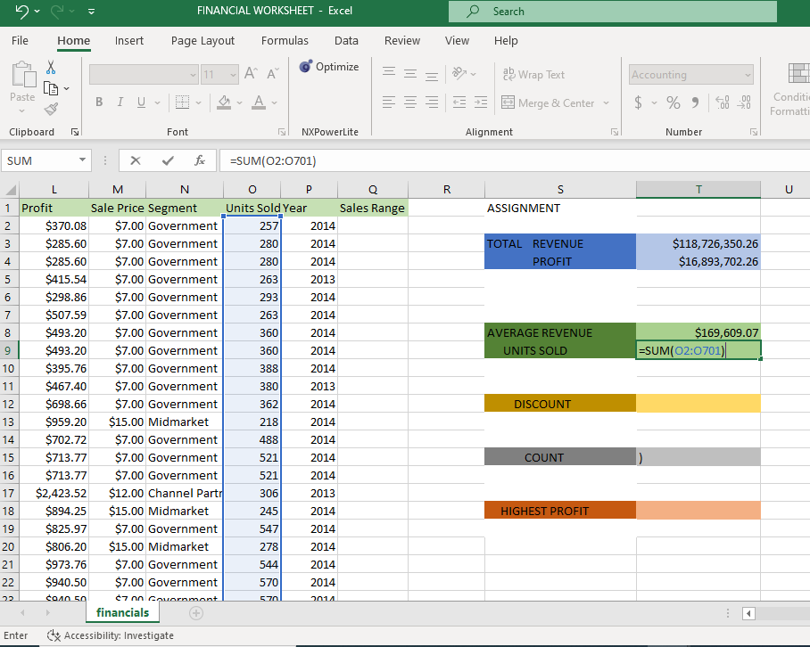
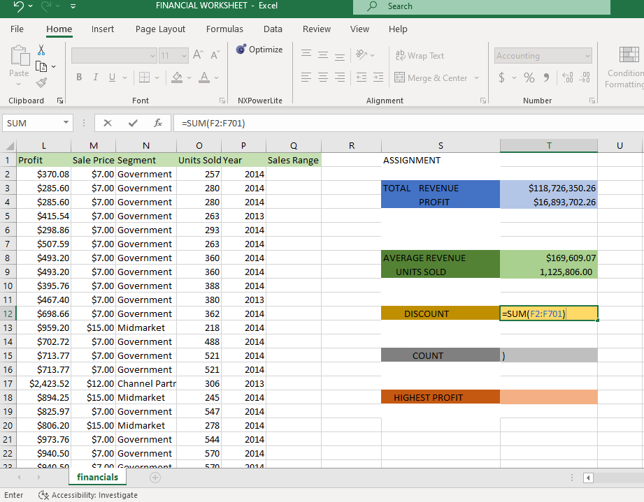
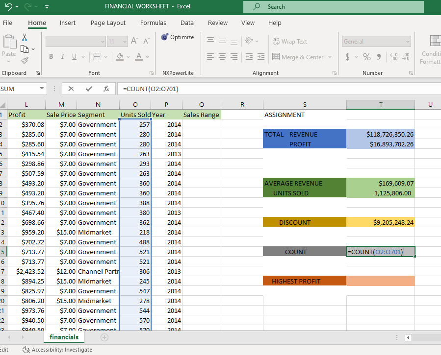
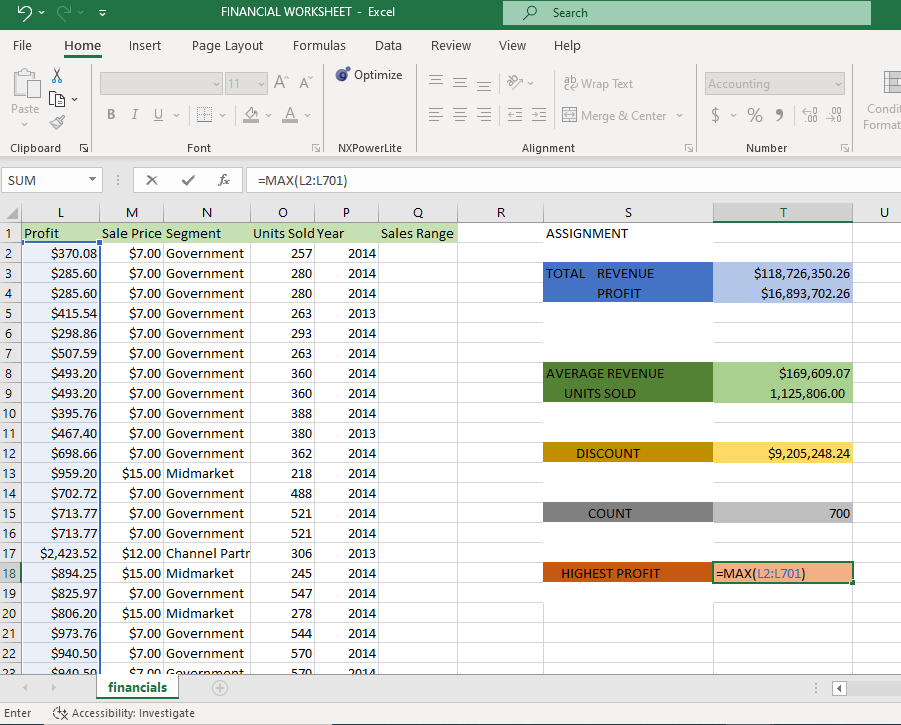
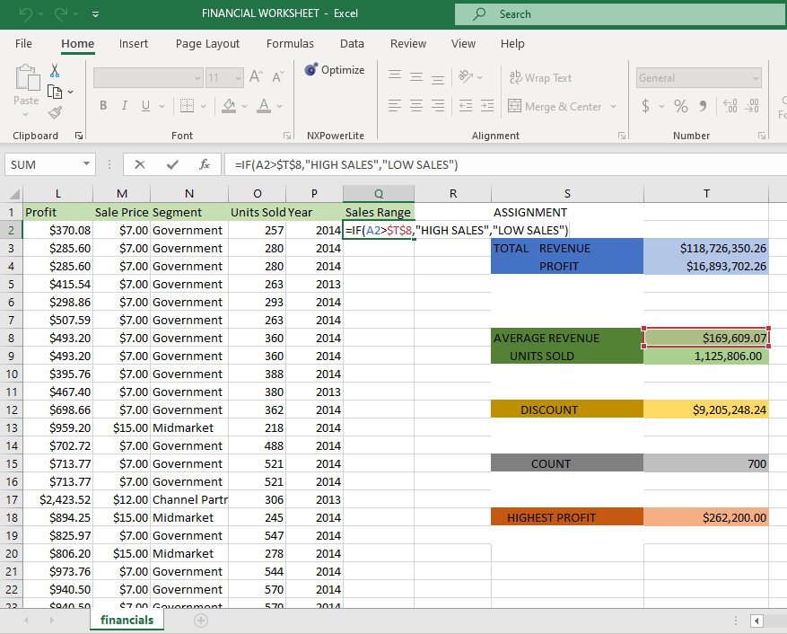

#Assignment 3
## we were given sales data to determine _the total revenue and profit generated, the average revenue and units sold for every order, the total discount given in $, the total number of sales recorded, the highest profit generated, also to create a column named 'sales range' return 'High sales' if the sales value is above average, otherwise return 'Low sales'_.
### On this sales data, I used the sum formula to determine the total revenue,by entering the name box function which is A, that is =sum(sales) to get the total revenue on the sales data.

### I set this column as currency, Also to determine the total profit,I used the sum formula as well by entering the name box function L, that is =sum(profit) to get the total profit.

### For average revenue, I used the average formula to get the average revenue which is =average(sales).

### Units sold for this data, I used the sum formula as well on the units sold column, =sum(units sold).

### Total discount given in $, I used the sum formula, that is =sum(discount) column to get the total discount in $

### Total number of sales recorded, I used the count formula which is =count(units sold) column to the count.

### Highest profit, I used th Max formula to get the highest profit that is =Max(profit).

### I created a new column and named it sales range,I used the IF formula that is =IF(TOTAL REVENUE>"HIGH SALES","LOW SALES") TO determine the sales range as the sales that are high and low.

